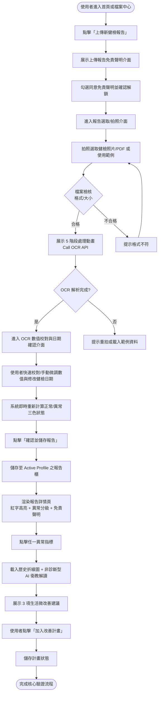
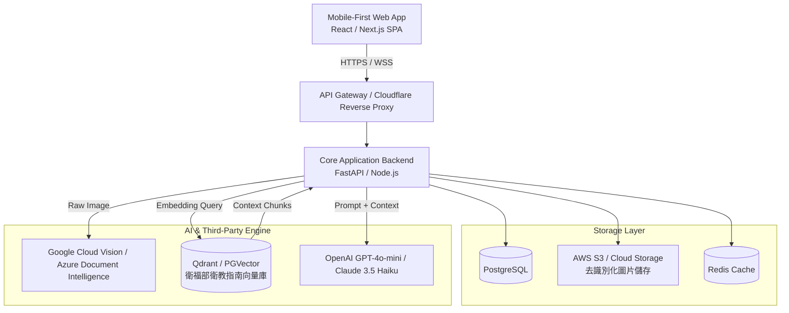
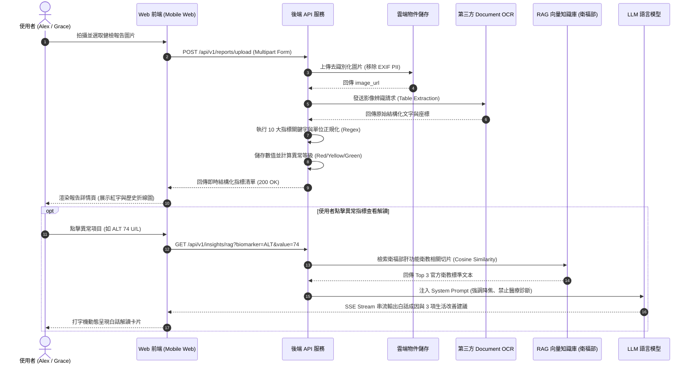
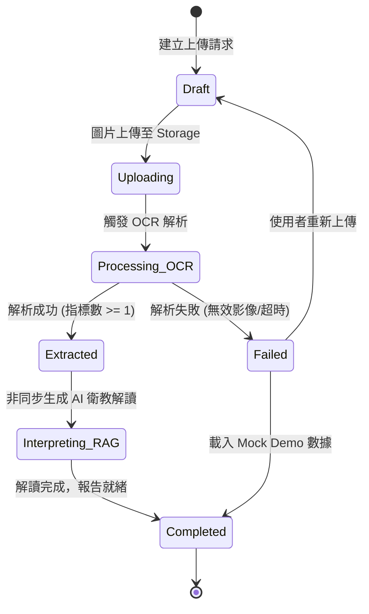
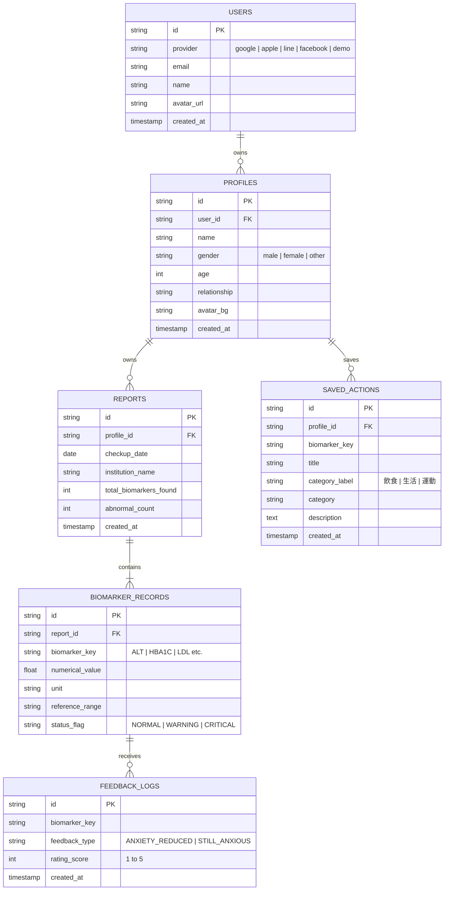

# Healnsight 產品需求與技術規格說明書

| 文件版本 | 發布日期 | 文件狀態 | 作者 | 檢視者 |
| --- | --- | --- | --- | --- |
| `v0.1.2`  | 2026-09-03 | Ready for Review | Gina, Shaun | ENG team |

---

## 1. Context & Objectives（背景與目標）

### 1.1 Business Context & Goals
台灣每年產出超過 740 萬份健檢報告，絕大多數受檢者在取得紙本或 PDF 報告當天僅翻閱一次。現行使用者旅程存在三大結構性斷點：
1. **資料碎片化且難以跨院所累積**：健檢資料散落於各醫院系統或紙本抽屜，手動建檔成本過高。
2. **名詞晦澀引發健康焦慮與 AI 幻覺**：自費健檢紅字常導致使用者透過 Google 搜尋得到極端致病結論，或使用通用型 LLM 產生未受醫療指引校準的幻覺解答。
3. **缺乏明確的下一步行動指引**：傳統健康報告多著重於呈現檢測結果與風險警示，但缺乏從「發現問題」到「採取行動」的具體指引。

**產品願景**：打造個人專屬的「健檢翻譯官」與「趨勢管家」。Healnsight 致力將零散的紙本報告，轉譯為 **「看得懂、能累積、可行動」的長期數位健康資產** ；我們超越單純的數據展示，進階為使用者的「健康決策夥伴」，透過直覺的資訊呈現與趨勢洞察，讓健康管理真正轉化為日常行動。

### 1.2 Strategies

為了實現產品願景，本專案 MVP 鎖定 **Mobile-first Web** 核心體驗，善用手機拍照、推播提醒與直覺圖表，將難懂的紙本健檢變成隨手可查、持續追蹤的健康夥伴。

| Strategy | Actions (細節請見下方說明) | Scope & Non-scope |
| :--- | :--- | :--- |
| **行動裝置優先** | • 採用 Mobile-First Web 設計，免下載 App 即開即用<br>• 建立 Bottom Navigation，固定核心功能入口<br>• 採用快速登入降低使用門檻 | **In Scope**<br>• 手機螢幕尺寸最佳化介面（Mobile Viewport）<br>• 持久型底部導覽列，內容包含首頁、趨勢、行動、我的<br>• 支援常見社群快速登入<br>• RWD介面<br><br>**Out of Scope**<br>• iOS / Android 原生 App |
| **健康數據能累積** | • 手機拍照或選取照片，OCR 自動抓取 10 大關鍵數值<br>• 支援使用者快速校對與手動修改數值<br>• 整合歷年健檢，自動繪製 10 大指標歷史變化趨勢圖<br>• 支援同一使用者建立多個健康檔案 | **In Scope**<br>• 台灣各健檢中心紙本拍照與 PDF 上傳解析10 大核心數值<br>• 支援使用者快速校對與手動修改數值<br>• 跨年折線比對<br>• 支援同一使用者建立多個健康檔案<br><br>**Out of Scope**<br>• 串接醫院系統或健保資料<br>• 直接授權串接複雜影像（X 光、超音波）等非數值報告判讀<br>• Apple Health / Wearable SDK 雙向同步 |
| **AI 白話指標說明** | • 用「紅黃綠」三色清楚標示數值是否在安全範圍<br>• 串接醫學指引之 AI，把晦澀術語翻成日常白話說明<br>• 提供指標釋義卡片，並設有避免做出診斷之安全免責機制 | **In Scope**<br>• 標準參考值對照與紅字警示標籤針對異常指標<br>• 基於衛福部 RAG 提供白話指標代表意義與日常關聯說明<br><br>**Out of Scope**<br>• 開放式、無邊界的線上問診、診斷或用藥建議<br>• 罕見疾病或多重症狀的深度診斷推論 |
| **知道下一步怎麼做** | • 建立獨立行動中心，提供異常項目指引 | **In Scope**<br>• 獨立行動中心<br>• 10 大指標對應的飲食作息建議與建議就診科別<br>• 每項指標 3 項輕量化生活改善指引卡片<br><br>**Out of Scope**<br>• 醫院門診線上代掛號服務<br>• 保健食品或保險商品導購功能 |

**Actions 細節**：

- **快速登入降低使用門檻**：提供 Google, Apple, LINE, Facebook 4 大主流社群登入，免註冊即可一鍵進入首頁體驗完整健康管理功能。
- **固定底部導覽列 (Bottom Navigation)**：清晰區分「首頁、趨勢、行動、我的」，優化整體資訊導覽效率。
- **拍照與 OCR 自動結構化解析**：支援拍照或上傳健檢報告圖片，自動擷取 10 大核心生理指標，並支援使用者快速校對與手動修改數值，可在 60 秒內建立數位健康檔案。
- **OCR 後快速校對與手動修改數值**：辨識完成後提供檢核畫面，支援手動修改數值、填寫健檢日期與機構，即時連動三色狀態評估。
- **跨年歷史趨勢折線圖**：視覺化呈現 5 年歷史指標變化，支援縮放與時間軸比對，方便掌握健康走向。
- **我的檔案中心：**
    - **健康隱私防護**：多成員個人檔案及健檢報告採用安全傳輸與資料庫隔離儲存，保障醫療隱私。
    - **個人資訊區域**：顯示個人暱稱、性別、年齡，並支援彈性編輯。
    - **我的報告櫃 (Condensed Cabinet)**：採用高密度水平佈局，直觀區分年度報告異常狀態與一覽檢驗紀錄。
    - **多個人檔案選單**：全站顯示選單可切換多個個人/家庭成員檔案。
- **視覺化紅字異常標示**：根據衛福部或各大醫院提供之參考值標示三色區間，並依據嚴重程度（明顯異常、須留意、正常）自動排序。
- **AI 白話說明**：整合衛福部衛教指南與 RAG 技術，針對異常指標提供教練式白話解讀，降低醫療專業術語引發的焦慮，同時顯示「AI回覆不可作為診斷，如有需要應尋求適當醫療協助」等免責聲明。
- **獨立行動中心 (Action Hub)**：集中管理 3 項明天就能開始的改善微行動，具備以下核心功能：
    - **就醫與複檢建議**：自動對應建議科別與追蹤時間，支援一鍵加入行事曆。
    - **免費篩檢資格偵測**：根據使用者個人檔案年齡智慧標示符合資格之官方免費福利（如成人預防保健）。
    - **年度提醒與智慧加項**：自動計算下次健檢日期，並預計建議加強項目。
    - **整合式 AI 教練卡片**：在首頁合併趨勢洞察與微行動進度，並提供即時的「下一步」行動提醒。

### 1.3 Success Metrics / KPIs

| 指標 | 想要驗證什麼 | 計算方式 |
| --- | --- | --- |
| **Primary (核心價值)**<br>任一改善微行動點擊率 ≥ 50% | • 產品是否達成核心願景：從「單純看報告」進階到「促成健康行動決策」<br>• 早期用戶是否真的對系統給出的改善指引產生動機並願意採取下一步。 | (點擊任一改善微行動的有效 Session 數) / 總有效 Session 數 $\times$ 100% |
| **Leading**<br>核心端到端流程成功率（拍照 → 產出報告）≥ 80% | MVP 基礎建設與核心使用流程是否順暢可用。 | (成功完成「拍照上傳 → OCR 解析確認 → 進入報告瀏覽趨勢 OR 行動」的有效 Session 數) / (點擊「開始拍照 / 上傳報告」的總觸發 Session 數) $\times$ 100% |

## 2. Rollout Plan & Feature Flags

- **發布方式**：單一 Production 環境，採用 Mobile-First 響應式網頁 (RWD)。
- **Feature Flags 配置**：
    - `FLAG_OCR_MOCK_FALLBACK` (Default: `false`): 當第三方 OCR API 超時或失敗時，提供預設 Demo 報告供使用者體驗流程。
    - `FLAG_RAG_STREAMING` (Default: `true`): AI 白話解讀採用 SSE (Server-Sent Events) 打字機流式輸出。

## 3. User Personas & Use Cases（使用者畫像與使用情境）

### 3.1 Target Personas

| Persona A: 焦慮上班族 Alex (33歲)  | Persona B: 家庭照護者 Grace (42歲)  |
| --- | --- |
| • 身份：軟體專案經理，高壓久坐、外食<br>• 痛點：健檢紅字上網查越查越慌，怕死<br>• 目標：獲得白話降焦解讀與低門檻行動 | • 身份：行銷主管，三明治世代照護父母<br>• 痛點：長輩報告紙本散落，看診難彙整<br>• 目標：跨年趨勢折線圖，看診一秒出示 |

### 3.2 User Stories & Acceptance Criteria (Gherkin AC)

#### US01: 拍照與 OCR 自動結構化解析

- **As a** 拿到紙本健檢報告的上班族 Alex,
- **I want to** 使用手機拍照上傳報告影像,
- **So that** 我不需要手動輸入繁瑣的數值，即可在 60 秒內建立數位健康檔案。

```gherkin
Feature: 健檢報告 OCR 辨識
  Scenario: 成功上傳並辨識清晰的健檢報告圖片
    Given 使用者已在報告上傳頁面，並選取一張符合格式的清晰圖片 (JPEG/PNG, < 10MB)
    When 使用者點擊「開始辨識」
    Then 系統應顯示上傳進度與 Skeleton Loading 載入動畫
    And 系統需在 30 秒內完成辨識，且 10 大核心指標解析率需達 80% 以上
    And 系統導引使用者至「數據校對頁面」，以確認辨識數值、體檢日期與健檢機構
    When 使用者確認校對資料並提交
    Then 系統自動跳轉至報告詳情頁，並完整展示解析出的數值與單位

  Scenario: 使用者上傳模糊或非健檢檔案
    Given 使用者上傳解析度過低、模糊或無關之圖片檔案
    When OCR 解析後可辨識之核心指標數為 0
    Then 系統停留在上傳頁面並彈出 Error Toast「無法辨識有效健檢數值，請確保光線充足並重新拍攝」
    And 提供「使用範例報告體驗」按鈕作為 Fallback
```

#### US02: 視覺化紅字異常標示與三色區間

- **As a** 看不懂醫學檢驗代碼的受檢者,
- **I want to** 系統以顏色及區間標示異常項目,
- **So that** 我能立即掌握身體哪些指標偏離標準。

```gherkin
Feature: 生理指標異常標示
  Scenario: 指標超出台灣衛福部參考區間
    Given 系統已成功解析使用者數據，其中 ALT 數值為 74 U/L (標準值 <= 40 U/L)
    When 使用者進入報告總覽頁面
    Then 該指標數值以紅字標示，並附加「偏高」標籤 (Badge)
    And 指標卡片背景呈現淺紅警示色，排序列優先置頂於「待關注指標」區塊
```

#### US03: 10 大核心生理指標歷史折線圖

- **As a** 陪同長輩回診的照護者 Grace,
- **I want to** 查看跨年份的關鍵指標折線圖並,
- **So that** 我能在門診時直接提供給醫師作為用藥與病況評估參考。

```gherkin
Feature: 跨年度指標趨勢視覺化
  Scenario: 存在 2 份以上歷史報告時繪製趨勢圖
    Given 使用者已累積輸入 2024 年與 2025 年之健檢報告
    When 使用者點擊進入「eGFR 腎絲球過濾率」趨勢頁
    Then 系統展示以時間為 X 軸、數值為 Y 軸之折線圖（資料點 X 座標為體檢時間），並標繪標準參考區間綠色陰影帶
    And 提供「一鍵儲存/分享給醫師」按鈕，點擊後觸發 Web Share API 或產生高解析度圖表圖檔
```

#### US04: 衛福部指引 RAG AI 白話說明

- **As a** 看到紅字感到恐慌的使用者 Alex,
- **I want to** 閱讀由官方衛教資料庫生成的白話成因說明,
- **So that** 我能獲得客觀安心的解釋，避免被未經驗證的搜尋結果誤導。

```gherkin
Feature: RAG AI 白話衛教釋義
  Scenario: 針對紅字指標生成白話解讀
    Given 使用者點擊異常指標「三酸甘油酯 (TG) 260 mg/dL」
    When 系統觸發 RAG 檢索生成請求
    Then 系統於 3 秒內透過 Streaming 輸出以衛福部衛教指南為基底之白話文（< 150 字）
    And 文末強制渲染免責聲明「本 AI 指標說明係依據衛福部與國民健康署衛教指引提供之生活促進參考，絕不構成任何臨床醫療診斷、處置或處方依據。若數值異常或自覺不適，請務必諮詢專業專科醫師。」
    And 卡片底部提供回饋機制：「這段說明容易理解，並有幫助您了解自身狀況嗎？ [👍 清楚有幫助] / [👎 不易理解]」
```

#### US05: 3 項輕量化生活改善指引與推播

- **As a** 希望改善異常指標的亞健康使用者,
- **I want to** 取得 3 項明天就能執行的具體微小行動建議,
- **So that** 我能有明確方向開始調整生活作息與飲食。

```gherkin
Feature: 生活型態改善指引與通知
  Scenario: 系統呈現低門檻行動卡片並追蹤採納
    Given 使用者檢視尿酸 (UA) 異常報告
    When 系統完成解讀
    Then 系統精準呈現 3 項行動卡片（例：每日補充 2000cc 水分、火鍋不喝湯底、手搖飲改無糖）
    And 每個卡片提供「加入我的改善計畫」核取方塊
    When 使用者點擊核取方塊
    Then 系統提示「已加入改善計畫」，並於改善清單頁面顯示
```

- Reference: 行動卡片建議可以參考的資料
    - [衛生福利部國民健康署 - 慢性病防治](https://www.hpa.gov.tw/Pages/List.aspx?nodeid=46)
    - [衛生福利部國民健康署 - 成人預防保健880方案衛教資源](https://www.hpa.gov.tw/Pages/Detail.aspx?nodeid=1115&pid=18732)
    - [衛生福利部國民健康署 - 營養及健康飲食](https://www.hpa.gov.tw/Pages/List.aspx?nodeid=36)
    - [衛生福利部國民健康署 - 肥胖防治](https://www.hpa.gov.tw/Pages/List.aspx?nodeid=35)
    - [科學算病館 慢性疾病風險評估平台 首頁](https://cdrc.hpa.gov.tw/index.jsp)

## 4. Information Architecture & User Flows（資訊架構與使用者流程）

### 4.1 Site Map / Information Architecture

```
Healsight Web Application (App-Shell Layout)
│
├── 頂部品牌 Header (深綠底白字 / Health + Insight Logo)
│   └── 右上角 Profile Switcher (下拉切換個人檔案 / + 新增檔案 / 地端儲存標示)
│
├── 底部導覽列 (Bottom Nav Bar - 4 大頁籤)
│   ├── / [首頁] Dashboard
│   │   ├── 個人化 AI 洞察摘要卡片 (結合當前 Profile 稱謂與異常摘要)
│   │   ├── 改善行動進度條 (下一步即時提醒)
│   │   ├── 核心指標狀態列表 (明顯異常優先排序)
│   │   └── 上傳新健檢報告按鈕 (進入 OCR 辨識與校對流程)
│   │
│   ├── /trends [趨勢] Trends
│   │   ├── 指標趨勢總覽列表
│   │   └── 明顯異常指標優先置頂
│   │
│   ├── /actions [行動] Action Hub
│   │   ├── 日常改善微行動清單 (依 profileId, biomarkerKey, actionId 三層架構獨立儲存)
│   │   ├── 就醫與複檢建議 (科別建議、加入行事曆)
│   │   ├── 免費篩檢資格偵測 (符合資格與免費標示)
│   │   ├── 年度健檢排程 (點選加入行事曆 .ics / 系統不主動推播)
│   │   └── 衛教免責聲明告示
│   │
│   └── /profile [我的] Profile Center (檔案中心)
│       ├── 個人資訊區域 (暱稱、生理性別、年齡，支援編輯)
│       ├── 多個人/家庭檔案管理卡片
│       └── 我的報告櫃 (Condensed Cabinet 高密度水平佈局)
|
├── /login 快速登入頁
│
├── /upload [上傳] Upload
│   ├── 每次上傳報告前免責聲明 Gate (每次上傳前強制確認同意免責聲明)
│   ├── 拍照 / 檔案選擇元件 (或範例報告體驗)
│   ├── 5 階段處理動畫 (上傳 > 辨識 > 對照 > 整合 > 洞察)
│   └── OCR 數值快速校對與手動修改 (日期選擇、機構輸入、即時三色狀態重新評估)
│
├── /reports/:reportId (單次報告詳情頁)
│   ├── 健檢基本資訊 (日期、機構)
│   ├── 完整數值對照清單 (異常高亮)
│   └── 醫療免責聲明
│
└── /trends/:biomarkerKey (指標趨勢頁)
    ├── 5 年歷史折線圖 (含標準區間帶)
    ├── AI 白話解讀與健康趨勢提醒 (非診斷化語言)
    ├── 醒目法定醫療免責聲明 Banner
    ├── 指標科學定義說明
    └── 明天就能開始的微行動 (書籤收藏功能)
```

### 4.2 Happy Path Flowchart



### 4.3 Exception / Edge Case Flow

```mermaid
flowchart TD
    subgraph OCR_Exception [情境 A: OCR 辨識異常]
        A1[上傳模糊/反光圖片] --> A2[後端解析失敗/無數值]
        A2 --> A3[顯示重試介面: 提示避開反光、文字保持水平]
        A3 --> A4[提供一鍵填入「範例報告」按鈕確保體驗不中斷]
    end

    subgraph RAG_Timeout [情境 B: LLM / RAG 服務超時]
        B1[使用者開啟異常指標解讀] --> B2[RAG 服務呼叫逾時 > 5s]
        B2 --> B3[自動降級: 顯示衛福部靜態衛教規則庫預設解讀]
        B3 --> B4[右下角微提示「目前使用離線衛教指引」]
    end

    subgraph Network_Drop [情境 C: 上傳中斷網]
        C1[圖片傳輸中斷] --> C2[前端偵測 Offline 事件]
        C2 --> C3[顯示重試按鈕並保留本地已選圖片暫存]
    end
```



---

## 5. UI/UX Specifications（介面與體驗規格）

### 5.1 視覺風格 (Visual Language)

- **色彩系統**：
    - 品牌主色：深綠色 (#137333)。
    - Header：深綠底白字，提升品牌權威感。
    - AI 洞察卡片：採用柔和淺綠漸層，降低閱讀壓力。
- **字體排版**：導入 Inter 字體，標題強化對比度 (#111827)，確保易讀性。
- **佈局**：
    - **Viewport & Breakpoints Strategy**：

| 斷點類型 | Viewport 範圍 | 佈局行為與適配規範 |
| --- | --- | --- |
| **Mobile (主要)** | `< 768px` | 滿版單欄佈局 (Single Column)，兩側 Margin `16px`，底部保留 `safe-area-inset-bottom`。 |
| **Tablet** | `768px ~ 1024px` | 內容容器限制最大寬度 `640px` 水平置中，卡片內部改為雙欄排列。 |
| **Desktop** | `> 1024px` | 內容容器限制最大寬度 `480px` (App-like Shell) 置中呈現，背景給予低對比底色。 |
- **禁用瀏覽器 Scrollbar**：捲動範圍限制在中央內容區。
- **固定導覽**：頂部 Logo 與底部選單在捲動時保持固定。

### 5.2 Screen States（元件 5 種狀態矩陣）

| State | UI/UX 行為定義 |
| --- | --- |
| 1. Normal | 預設視覺層級，高對比文字，圖標清晰。 |
| 2. Touch/Hover | 點擊反饋：縮放 `scale(0.98)`，背景透明度 `opacity: 0.9` |
| 3. Active | 頁籤切換高亮、按鈕獲焦 (Focus Ring: 2px Primary Color) |
| 4. Disabled | 背景反灰 (`#E0E0E0`)，文字變淡，禁用點擊 (`pointer-events: none`) |
| 5. Skeleton | 載入時使用灰階漸層 Shimmer 動畫，嚴禁純白畫面等待 |

### 5.3 Mobile Interaction Guidelines

- **Touch Target Size**：所有可點擊按鈕與核取方塊之最小觸控範圍為 `44 x 44 px`。
- **Sticky Action Bar**：首頁「拍照上傳」與趨勢頁「儲存圖表」按鈕固定於底部，避開 iOS Safari 底部導覽列 (`padding-bottom: env(safe-area-inset-bottom)`)。
- **鍵盤彈出避讓**：輸入數值時，使用 `scrollIntoView({ behavior: 'smooth', block: 'center' })` 防止虛擬鍵盤遮蔽送出按鈕。

### 5.4 核心頁面優化

- **Dashboard**：
    - **AI 洞察展開**：摘要預設顯示 4 行，提供「閱讀更多」互動。
    - **下一步提醒**：在進度條下方以小字提示第一項未完成任務。
    - **指標排序**：明顯異常 > 須留意 > 正常。
- **Actions**：
    - **優先序**：將「日常改善微行動」置頂，強調即時改變。

## 6. Business Logic & Domain Rules

#### **6.1 核心 10 大生理指標清單**

1. 飯前血糖 (`AC`)
2. 糖化血色素 (`HbA1c`)
3. 總膽固醇 (`TC`)
4. 三酸甘油酯 (`TG`)
5. 高密度脂蛋白膽固醇 (`HDL-C`)
6. 低密度脂蛋白膽固醇 (`LDL-C`)
7. 丙胺酸轉胺酶 / 肝功能 (`ALT / GPT`)
8. 天門冬胺酸轉胺酶 / 肝功能 (`AST / GOT`)
9. 腎絲球過濾率 (`eGFR`)
10. 尿酸 (`Uric Acid / UA`)

#### 6.2 10 大核心生理指標臨床判讀標準與正則定義表

參考資料：[檢驗參考值 | 台大醫院 | 健康教育資訊網](https://health.ntuh.gov.tw/health/hrc_v3/DataFiles/kensa.htm)

| 指標名稱 | 標準代碼 | 英文別名 (OCR 比對關鍵字) | 單位 | 正常參考區間 (台大標準) | 異常判定邏輯 (Rule Engine) |
| --- | --- | --- | --- | --- | --- |
| **飯前血糖** | `GLU_AC` | Fasting Glucose, AC, 血糖 | `mg/dL` | `70 ~ 100` | `< 70` 偏低 (Yellow) / `101 ~ 125` 偏高 (Yellow) / `>= 126` 異常 (Red) |
| **糖化血色素** | `HBA1C` | HbA1c, A1C, 糖化血紅素 | `%` | `4.0 ~ 6.0` | `6.1 ~ 6.4` 偏高 (Yellow) / `>= 6.5` 異常/糖尿病 (Red) |
| **總膽固醇** | `CHOL` | Total Cholesterol, T-CHO, 總膽固醇 | `mg/dL` | `< 200` | `200 ~ 239` 邊緣偏高 (Yellow) / `>= 240` 異常 (Red) |
| **三酸甘油酯** | `TG` | Triglyceride, TG, 中性脂肪 | `mg/dL` | `< 150` | `150 ~ 199` 邊緣偏高 (Yellow) / `>= 200` 異常 (Red) |
| **高密度脂蛋白** | `HDL` | HDL-C, 高密度膽固醇 | `mg/dL` | 男性 `> 40`<br>女性 `> 50` | 男性 `<= 40` 或 女性 `<= 50` 偏低 (Red) |
| **低密度脂蛋白** | `LDL` | LDL-C, 壞膽固醇, 低密度 | `mg/dL` | `< 130` *(理想值 < 100)* | `100 ~ 129` 理想邊緣 (Yellow) / `130 ~ 159` 偏高 (Yellow) / `>= 160` 顯著異常 (Red) |
| **丙胺酸轉胺酶** | `ALT` | ALT, GPT, 肝功能 | `U/L` | `< 41` | `41 ~ 80` 輕度偏高 (Yellow) / `> 80` 顯著異常 (Red) |
| **天門冬胺酸轉胺酶** | `AST` | AST, GOT | `U/L` | `< 31` | `31 ~ 60` 輕度偏高 (Yellow) / `> 60` 顯著異常 (Red) |
| **腎絲球過濾率** | `EGFR` | eGFR, 腎絲球過濾率 | `mL/min/1.73m²` | `>= 60` *(理想值 >= 90)* | `60 ~ 89` 腎功能輕度下降 (Yellow) / `< 60` 慢性腎臟病疑慮 (Red) |
| **尿酸** | `UA` | Uric Acid, 尿酸, UA | `mg/dL` | 男性 `4.4 ~ 7.6`<br>女性 `2.5 ~ 6.6` | 男性 `> 7.6` 或 女性 `> 6.6` 偏高/高尿酸血症 (Red)；男性 `< 4.4` 或 女性 `< 2.5` 偏低 (Yellow) |
- **OCR 數值驗證正則 (Regex)**：`^([0-9]{1,4})(\.[0-9]{1,2})?$`（限制整數最多 4 位，小數最多 2 位）。
- **指標狀態用語標準化**：
    - `CRITICAL`: 明顯異常 (Red)
    - `WARNING`: 須留意 (Yellow)
    - `NORMAL`: 正常 (Green)

## 7. Product Telemetry & Analytics（數據埋點與監控）

### 7.1 Event Tracking Matrix (Schema)

| 事件名稱 (Event Name) | 觸發時機 (Trigger Condition) | 上報參數 (Payload Parameters) |
| --- | --- | --- |
| `upload_started` | 使用者點擊選擇檔案並確認上傳 | `file_type (image/pdf)`, `file_size_kb` |
| `ocr_completed` | 後端成功回傳解析數值並渲染 | `duration_ms`, `biomarkers_detected_count`, `success (true/false)` |
| `ocr_calibrated` | 使用者完成 OCR 數值快速校對或修改健檢日期後確認儲存 | `edited_markers_count`, `checkup_date_modified (true/false)` |
| `profile_switched` | 使用者切換個人/家庭成員檔案 | `profile_id`, `relationship` |
| `trend_chart_viewed` | 進入指標趨勢折線圖頁面 | `biomarker_key`, `historical_points_count`, `dwell_time_seconds` |
| `ai_insight_generated` | RAG 白話解讀卡片渲染完成 | `biomarker_key`, `is_fallback (true/false)`, `response_time_ms` |
| `anxiety_feedback_submitted` | 點擊白話解讀下方的 👍 / 👎 | `biomarker_key`, `feedback_value (REDUCED / ANXIOUS)` |
| `action_plan_committed` | 勾選生活改善建議卡片上的核取方塊 | `biomarker_key`, `action_id`, `action_category` |

## 8. System Integration & Sequence Flows（系統整合與時序圖）

### 8.1 System Architecture Overview



### 8.2 Sequence Diagrams (End-to-End Processing)



### 8.3 State Machine Diagrams



## 9. Data Specifications & API Contracts（資料與 API 規格）

### 9.1 Data Entities & ERD



### 9.2 正式 Production 資料存放架構規範 (Data Storage Partitioning)

根據安全性、合規性與多成員管理需求，正式環境之資料存放標準如下：

1. **伺服器資料庫 (Server Database)**：
    - **使用者 OAuth 登入資訊** (`USERS`)：存放第三方授權唯一識別碼、登入管道、信箱與使用者 Profile 連結。
    - **個人檔案 (Profiles)**：支援單一使用者建立多個獨立個人檔案（如：本人、父母、小孩等）。
    - **歷年健檢指標紀錄** (`REPORTS`, `BIOMARKER_RECORDS`)：保存各年度健檢數值、機構、日期與正常/異常指標狀態。
    - **AI 健康趨勢洞察** (`TREND_INSIGHTS`)：依據長期數據產出之跨年度綜合健康分析。
    - **指標 AI 白話解釋** (`BIOMARKER_EXPLANATIONS`)：結合衛福部衛教手冊產出之非診斷型成因釋義。
    - **已儲存的日常改善微行動** (`SAVED_ACTIONS`)：使用者為各成員自訂或收藏的生活改善微行動。
2. **瀏覽器 localStorage / IndexedDB (Client Storage)**：
    - **Storage Scheme 版本控制** (`healsight_storage_version`)：追蹤客戶端快取架構版本，確保資料遷移一致性。
    - **已登入的使用者資訊** (`healsight_auth_user`)：暫存目前登入者 Session、認證權限 Token 與使用者基本識別。
    - **每週完成的「日常改善微行動」狀態** (`healsight_weekly_action_completions`)：
        - 採 `[profileId][actionId] = boolean` 鍵值結構存取每週打卡進度，確保不同成員間打卡紀錄互相獨立。

### 9.3 API Functional Specs (Contract)

本節依據系統之 **OAuth 認證標準** 與 **8.1 實體關聯圖 (ERD: `USERS`, `PROFILES`, `REPORTS`, `BIOMARKER_RECORDS`, `SAVED_ACTIONS`, `FEEDBACK_LOGS`)** 定義完整的 RESTful API 規範。

#### 共通通訊與安全協定 (Common Protocols)

- **Base URL**: `https://<production domain>/api/v1`（開發環境：`http://localhost:3001/api/v1`）
- **授權標頭 (Authorization Header)**：除 OAuth 登入端點外，所有請求皆須在 Header 攜帶 JWT Bearer Token：
    
    ```
    Authorization: Bearer <JWT_ACCESS_TOKEN>
    ```
    
- **標準回應信封格式 (Standard Response Envelope)**：
    - **成功回應 (Success)**：
        
        ```json
        {
          "code": 200,
          "message": "Operation completed successfully",
          "data": { ... }
        }
        ```
        
    - **錯誤回應 (Error)**：
        
        ```json
        {
          "code": 400,
          "message": "Validation failed",
          "error": {
            "code": "INVALID_BIOMARKER_VALUE",
            "details": "Numerical value must be a positive number with at most 2 decimal places"
          }
        }
        ```
        

#### 9.3.1 認證與 OAuth 管理模組 (Authentication & OAuth)

對應 ERD 實體：`USERS` (`id`, `provider`, `email`, `name`, `avatar_url`, `created_at`)

**1. OAuth 登入與展示帳號一鍵體驗 (`POST /api/v1/auth/login`)**

- **說明**：支援 Google、Apple、LINE、Facebook 4 大社群平台 OAuth 授權，以及免註冊的一鍵展示帳號體驗。後端驗證第三方 Token 或授權碼後，查詢或建立 `USERS` 記錄，並簽發存取 Token。
- **Request Header**: `Content-Type: application/json`
- **Request Payload**:
    
    ```json
    {
      "provider": "google", // "google" | "apple" | "line" | "facebook" | "demo"
      "id_token": "eyJhbGciOiJSUzI1NiIs...", // 第三方平台簽發之 ID Token (Demo 模式免填)
      "auth_code": "4/0AdQt8q...", // 授權碼 (若採用 Code flow)
      "email": "user@example.com", // 選填 (Demo 模式或第三方回傳之信箱)
      "name": "Alex Chen", // 選填
      "avatar_url": "<https://lh3.googleusercontent.com/>..." // 選填
    }
    ```
    
- **Response (200 OK)**:
    
    ```json
    {
      "code": 200,
      "message": "Login successful",
      "data": {
        "token": "eyJhbGciOiJIUzI1NiIsInR5cCI6IkpXVCJ9.eyJ1c2VySWQiOiJ1c3JfZ29vZ2xlXzEwMjkz...",
        "expires_in": 604800,
        "user": {
          "id": "usr_google_1029384756",
          "provider": "google",
          "email": "user@example.com",
          "name": "Alex Chen",
          "avatar_url": "<https://lh3.googleusercontent.com/>...",
          "created_at": "2026-03-01T08:00:00.000Z"
        }
      }
    }
    ```
    
- **業務規則**：
    - 若用戶為首次登入，後端於資料庫插入 `USERS` 記錄後，自動為其建立第一筆關係為「本人」的 `PROFILES` 檔案（預設名稱繼承 `USERS.name`）。
    - 若為 `provider: "demo"`，直接配發預設展示帳號與多組示範成員資料（Alex、媽媽）。

**2. 獲取當前登入者資訊 (`GET /api/v1/auth/me`)**

- **說明**：解析 Header 中的 JWT Bearer Token，回傳當前登入之 `USERS` 實體資訊。
- **Response (200 OK)**:
    
    ```json
    {
      "code": 200,
      "data": {
        "user": {
          "id": "usr_google_1029384756",
          "provider": "google",
          "email": "user@example.com",
          "name": "Alex Chen",
          "avatar_url": "<https://lh3.googleusercontent.com/>...",
          "created_at": "2026-03-01T08:00:00.000Z"
        }
      }
    }
    ```
    
- **錯誤代碼**：`401` (`AUTH_TOKEN_EXPIRED` 或 `AUTH_UNAUTHORIZED`)

**3. 帳號登出 (`POST /api/v1/auth/logout`)**

- **說明**：作廢使用者的 Access Token，清除伺服器端 Session 或加入 Redis 黑名單。
- **Response (200 OK)**:
    
    ```json
    {
      "code": 200,
      "message": "Logged out successfully"
    }
    ```
    

#### 8.3.2 個人檔案管理模組 (Profiles CRUD)

對應 ERD 實體：`PROFILES` (`id`, `user_id` [FK], `name`, `gender`, `age`, `relationship`, `avatar_bg`, `created_at`)

**1. 取得使用者名下所有個人檔案列表 (`GET /api/v1/profiles`)**

- **說明**：查詢目前登入用戶 (`USERS.id`) 所關聯的所有家庭成員健康檔案，包含其歷年健檢報告概況。
- **Response (200 OK)**:
    
    ```json
    {
      "code": 200,
      "data": [
        {
          "id": "prof_alex",
          "user_id": "usr_google_1029384756",
          "name": "Alex",
          "gender": "male",
          "age": 33,
          "relationship": "本人",
          "avatar_bg": "#1976d2",
          "created_at": "2026-03-01T08:00:00.000Z",
          "reports_count": 3,
          "latest_checkup_date": "2025-03-15",
          "reports": [ /* 歷年報告簡要列表，對應 REPORTS 實體 */ ]
        },
        {
          "id": "prof_mom",
          "user_id": "usr_google_1029384756",
          "name": "媽媽",
          "gender": "female",
          "age": 65,
          "relationship": "母親",
          "avatar_bg": "#d81b60",
          "created_at": "2026-03-02T10:30:00.000Z",
          "reports_count": 1,
          "latest_checkup_date": "2024-11-20",
          "reports": [ /* REPORTS 實體 */ ]
        }
      ]
    }
    ```
    

**2. 建立新個人/家庭成員檔案 (`POST /api/v1/profiles`)**

- **說明**：為當前登入者新增成員檔案。
- **Request Payload**:
    
    ```json
    {
      "name": "爸爸",
      "gender": "male", // "male" | "female" | "other"
      "age": 68,
      "relationship": "父親",
      "avatar_bg": "#0284c7" // 選填，未填寫依性別自動給予預設色系
    }
    ```
    
- **Response (201 Created)**:
    
    ```json
    {
      "code": 201,
      "message": "Profile created successfully",
      "data": {
        "id": "prof_dad_1741000000",
        "user_id": "usr_google_1029384756",
        "name": "爸爸",
        "gender": "male",
        "age": 68,
        "relationship": "父親",
        "avatar_bg": "#0284c7",
        "created_at": "2026-09-03T14:00:00.000Z",
        "reports": []
      }
    }
    ```
    

**3. 取得單一成員檔案詳情 (`GET /api/v1/profiles/:id`)**

- **說明**：取得指定個人檔案之完整資訊與其所有歷年檢驗數據。
- **Response (200 OK)**: 回傳單筆 `PROFILES` 實體物件與完整 `REPORTS` 集合。
- **錯誤代碼**：`404` (`PROFILE_NOT_FOUND`)、`403` (`FORBIDDEN_PROFILE_ACCESS`，禁止存取非本人名下之 Profile)。

**4. 更新成員個人資訊 (`PUT /api/v1/profiles/:id`)**

- **說明**：修改個人暱稱、生理性別、年齡或家庭關係。
- **Request Payload**:
    
    ```json
    {
      "name": "Alex",
      "gender": "male",
      "age": 34,
      "relationship": "本人",
      "avatar_bg": "#1976d2"
    }
    ```
    
- **Response (200 OK)**: 回傳更新後之 `PROFILES` 實體。

**5. 刪除成員檔案 (`DELETE /api/v1/profiles/:id`)**

- **說明**：刪除指定成員檔案，並於伺服器端資料庫**級聯刪除 (Cascade Delete)** 該檔案下所屬之所有 `REPORTS`、`BIOMARKER_RECORDS` 與 `SAVED_ACTIONS`。
- **Response (200 OK)**:
    
    ```json
    {
      "code": 200,
      "message": "Profile and all associated health records deleted successfully"
    }
    ```
    

#### 8.3.3 健檢報告與指標紀錄模組 (Reports & Biomarker Records)

對應 ERD 實體：

- `REPORTS` (`id`, `profile_id` FK, `checkup_date`, `institution_name`, `total_biomarkers_found`, `abnormal_count`, `created_at`)
- `BIOMARKER_RECORDS` (`id`, `report_id` FK, `biomarker_key`, `numerical_value`, `unit`, `reference_range`, `status_flag`)

**1. 上傳健檢報告圖片/PDF 觸發 OCR 解析 (`POST /api/v1/reports/upload`)**

- **說明**：接受多媒體健檢報告檔案，執行影像去識別化後呼叫 Document OCR 提取指標，回傳辨識與正規化草稿（供使用者進入校對介面）。
- **Content-Type**: `multipart/form-data`
- **Request Parameters**:
    - `file`: 二進位檔案（JPG、PNG、PDF，最大限制 10MB）
    - `profile_id`: 目標個人檔案 ID
- **Response (200 OK)**:
    
    ```json
    {
      "code": 200,
      "message": "OCR parsed successfully",
      "data": {
        "draft_report_id": "draft_rep_9b1deb4d",
        "profile_id": "prof_alex",
        "checkup_date": "2025-03-15",
        "institution_name": "國泰綜合健檢中心",
        "total_biomarkers_found": 10,
        "abnormal_count": 2,
        "records": [
          {
            "biomarker_key": "ALT",
            "display_name": "丙胺酸轉胺酶 (ALT/GPT)",
            "numerical_value": 74.0,
            "unit": "U/L",
            "reference_range": "< 40",
            "status_flag": "CRITICAL"
          },
          {
            "biomarker_key": "HBA1C",
            "display_name": "糖化血色素 (HbA1c)",
            "numerical_value": 5.4,
            "unit": "%",
            "reference_range": "4.0 - 5.6",
            "status_flag": "NORMAL"
          },
          {
            "biomarker_key": "LDL",
            "display_name": "低密度脂蛋白膽固醇 (LDL-C)",
            "numerical_value": 118.0,
            "unit": "mg/dL",
            "reference_range": "< 100",
            "status_flag": "WARNING"
          }
        ]
      }
    }
    ```
    
- **錯誤代碼**：`4001` (不支援之格式)、`4002` (檔案超過 10MB)、`4220` (OCR 無法辨識出任何有效數值)。

**2. 獲取特定成員歷年健檢報告清單 (`GET /api/v1/profiles/:profileId/reports`)**

- **說明**：依據 `profile_id` 查詢歷年報告，按 `checkup_date` DESC 降序排列。
- **Response (200 OK)**:
    
    ```json
    {
      "code": 200,
      "data": [
        {
          "id": "rep_2025_cathay",
          "profile_id": "prof_alex",
          "checkup_date": "2025-03-15",
          "institution_name": "國泰綜合健檢中心",
          "total_biomarkers_found": 10,
          "abnormal_count": 2,
          "created_at": "2025-03-15T09:30:00.000Z",
          "records": [ /* BIOMARKER_RECORDS 清單 */ ]
        }
      ]
    }
    ```
    

**3. 儲存校對確認之健檢報告 (`POST /api/v1/profiles/:profileId/reports`)**

- **說明**：校對頁面確認送出，後端以資料庫交易 (Database Transaction) 同步插入 `REPORTS` 主檔與多筆 `BIOMARKER_RECORDS` 明細檔。
- **Request Payload**:
    
    ```json
    {
      "checkup_date": "2025-03-15",
      "institution_name": "國泰綜合健檢中心",
      "records": [
        {
          "biomarker_key": "ALT",
          "numerical_value": 74.0,
          "unit": "U/L",
          "reference_range": "< 40",
          "status_flag": "CRITICAL"
        },
        {
          "biomarker_key": "HBA1C",
          "numerical_value": 5.4,
          "unit": "%",
          "reference_range": "4.0 - 5.6",
          "status_flag": "NORMAL"
        }
      ]
    }
    ```
    
- **Response (201 Created)**: 回傳已持久化入庫之 `REPORTS` 實體（包含系統產生之 UUID `id` 與各 `BIOMARKER_RECORDS.id`）。

**4. 查詢單份健檢報告詳情 (`GET /api/v1/reports/:id`)**

- **說明**：依報告 ID 取得該份報告及其所有包含之指標檢測數值與標準狀態。
- **Response (200 OK)**: 回傳完整 `REPORTS` 結構與關聯之 `BIOMARKER_RECORDS` 陣列。

**5. 刪除單份健檢報告 (`DELETE /api/v1/reports/:id`)**

- **說明**：刪除單次報告記錄，並自動級聯清除關聯之 `BIOMARKER_RECORDS`。
- **Response (200 OK)**: `{ "code": 200, "message": "Report deleted successfully" }`

#### 8.3.4 生理指標歷年趨勢模組 (Biomarker Trends)

基於 ERD 關聯：`BIOMARKER_RECORDS` JOIN `REPORTS` (WHERE `profile_id`)

**1. 查詢特定成員指標跨年度趨勢 (`GET /api/v1/profiles/:profileId/biomarkers/trends`)**

- **說明**：根據 `profileId` 及指定之 `biomarker_key`，彙整跨越不同健檢年度之數值變化與狀態。
- **Query Parameters**:
    - `biomarker_key`: `ALT` | `HBA1C` | `LDL` | `TG` | `CHOL` | `HDL` | `AST` | `EGFR` | `UA` | `GLU_AC`
- **Response (200 OK)**:
    
    ```json
    {
      "code": 200,
      "data": {
        "profile_id": "prof_alex",
        "biomarker_key": "ALT",
        "display_name": "丙胺酸轉胺酶",
        "unit": "U/L",
        "reference_standard": "< 40",
        "trend_points": [
          {
            "report_id": "rep_2023_cathay",
            "checkup_date": "2023-03-10",
            "numerical_value": 35.0,
            "status_flag": "NORMAL"
          },
          {
            "report_id": "rep_2024_cathay",
            "checkup_date": "2024-03-12",
            "numerical_value": 52.0,
            "status_flag": "WARNING"
          },
          {
            "report_id": "rep_2025_cathay",
            "checkup_date": "2025-03-15",
            "numerical_value": 74.0,
            "status_flag": "CRITICAL"
          }
        ]
      }
    }
    ```
    

#### 8.3.5 AI 健康趨勢洞察與衛教指引模組 (AI Insights & Explanations)

對應資料模型：`TREND_INSIGHTS` 與 `BIOMARKER_EXPLANATIONS`

**1. 生成異常指標白話解讀與 3 項生活建議 (`POST /api/v1/insights/generate`)**

- **說明**：整合衛福部向量庫檢索 (RAG) 與 LLM 語言模型，針對指定指標之歷年數值產出非診斷型成因分析與生活改善指引。
- **Request Payload**:
    
    ```json
    {
      "profile_id": "prof_alex",
      "biomarker_key": "ALT",
      "current_value": 74.0,
      "unit": "U/L",
      "historical_values": [35.0, 52.0]
    }
    ```
    
- **Response (200 OK - 支援 JSON Mode 或 SSE 串流)**:
    
    ```json
    {
      "code": 200,
      "data": {
        "biomarker_key": "ALT",
        "plain_text_summary": "您的 ALT 目前為 74 U/L，數值呈現偏高。這通常代表肝臟細胞近期受到代謝壓力或有輕度負擔，最常見的生活型態成因是近期熬夜、飲酒頻率增加或體重上升，先不用過度焦慮，這絕不代表肝硬化。",
        "risk_level_explanation": "輕度偏高，建議維持規律作息並於 1~3 個月後抽血複查。",
        "actionable_guidelines": [
          {
            "id": "act_alt_01",
            "biomarker_key": "ALT",
            "title": "手搖飲本週改為無糖或微糖",
            "category_label": "飲食",
            "category": "DIET",
            "difficulty": "LOW",
            "description": "減少果糖攝取能有效減輕肝臟脂肪代謝壓力。"
          },
          {
            "id": "act_alt_02",
            "biomarker_key": "ALT",
            "title": "每日增加 500cc 溫開水攝取",
            "category_label": "生活",
            "category": "LIFESTYLE",
            "difficulty": "LOW",
            "description": "維持充足水分加速身體代謝循環。"
          },
          {
            "id": "act_alt_03",
            "biomarker_key": "ALT",
            "title": "每晚 11 點前就寢，避免持續熬夜",
            "category_label": "睡眠",
            "category": "SLEEP",
            "difficulty": "MEDIUM",
            "description": "充足睡眠是肝細胞自我修復的最關鍵要素。"
          }
        ],
        "disclaimer": "本內容依據衛生福利部國民健康署健康管理指引產出，僅供個人日常預防與生活改善參考，嚴禁作為醫療診斷或替代醫師處方。"
      }
    }
    ```
    

**2. 取得成員整體 AI 教練趨勢洞察摘要 (`GET /api/v1/profiles/:profileId/insights/coach`)**

- **說明**：獲取首頁頂部由 AI 教練彙整跨年度數據產出之綜合健康趨勢洞察。
- **Response (200 OK)**: 回傳綜合摘要、改善進度比率與優先關注指標。

#### 8.3.6 已儲存日常改善微行動模組 (Saved Micro-Actions)

對應 ERD 實體：`SAVED_ACTIONS` (`id`, `profile_id` FK, `biomarker_key`, `title`, `category_label`, `category`, `description`, `created_at`)

> **備註**：微行動的「定義與收藏清單」持久化儲存於**伺服器資料庫**；而使用者每週的「打卡核取完成狀態」則由**瀏覽器 LocalStorage**（`healsight_weekly_action_completions`）依 `[profileId][actionId]` 隔離管理。
> 

**1. 取得成員已儲存微行動列表 (`GET /api/v1/profiles/:profileId/actions`)**

- **說明**：獲取該個人檔案目前儲存並正在執行的所有生活改善微行動。
- **Response (200 OK)**:
    
    ```json
    {
      "code": 200,
      "data": [
        {
          "id": "act_alt_01",
          "profile_id": "prof_alex",
          "biomarker_key": "ALT",
          "title": "手搖飲本週改為無糖或微糖",
          "category_label": "飲食",
          "category": "DIET",
          "description": "減少精緻糖分攝取減輕肝臟負擔",
          "created_at": "2026-03-15T10:00:00.000Z"
        }
      ]
    }
    ```
    

**2. 新增微行動至成員清單 (`POST /api/v1/profiles/:profileId/actions`)**

- **說明**：將 AI 推薦或使用者自訂之微行動儲存至伺服器資料庫。
- **Request Payload**:
    
    ```json
    {
      "id": "act_alt_01", // 選填，未填寫由伺服器生成
      "biomarker_key": "ALT",
      "title": "手搖飲本週改為無糖或微糖",
      "category_label": "飲食",
      "category": "DIET",
      "description": "減少精緻糖分攝取減輕肝臟負擔"
    }
    ```
    
- **Response (201 Created)**: 回傳新增成功之 `SAVED_ACTIONS` 實體。

**3. 移除微行動 (`DELETE /api/v1/profiles/:profileId/actions/:actionId`)**

- **說明**：從伺服器端刪除指定的微行動。
- **Response (200 OK)**: `{ "code": 200, "message": "Action removed successfully" }`

#### 8.3.7 使用者焦慮反饋紀錄模組 (Feedback Logs)

對應 ERD 實體：`FEEDBACK_LOGS` (`id`, `biomarker_key`, `feedback_type`, `rating_score`, `created_at`)

**1. 提交指標解讀降焦反饋 (`POST /api/v1/feedbacks`)**

- **說明**：記錄使用者閱讀 AI 白話衛教後之評分（0~1 分）與主觀感受，用於持續微調 Prompt 及臨床衛教成效評估。
- **Request Payload**:
    
    ```json
    {
      "biomarker_key": "ALT",
      "feedback_type": "ANXIETY_REDUCED", // "ANXIETY_REDUCED" | "STILL_ANXIOUS"
      "rating_score": 5, // 1 到 5 分
      "comment": "看完解釋後知道不用立刻擔心肝硬化，心情放鬆很多！"
    }
    ```
    
- **Response (201 Created)**:
    
    ```json
    {
      "code": 201,
      "message": "Feedback submitted successfully",
      "data": {
        "id": "fdb_1741000000",
        "biomarker_key": "ALT",
        "feedback_type": "ANXIETY_REDUCED",
        "rating_score": 5,
        "created_at": "2026-09-03T14:30:00.000Z"
      }
    }
    ```
    

### 8.4 導覽與持久化 (Navigation & Client Persistence)

- **localStorage 劃分機制**：
    - `healsight_storage_version`：版本控管（基準版 `1`），未標註版本或損毀時自動漸進遷移。
    - `healsight_auth_user`：保存登入者 Session 與 Token，支援 App 啟動無縫恢復身份。
    - `healsight_weekly_action_completions`：儲存每週打卡勾選狀態，依 `[profileId][actionId]` 隔離，換週自動重置打卡進度。
- **SPA 路由與 History API**：Catch-all 中間件確保在任何巢狀路由（如 `/reports/:reportId`、`/trends/:biomarkerKey`）刷新頁面不失聯。

## 9. Error Handling & Resilience（錯誤處理與容錯機制）

### 9.1 Network & Offline Behavior

- **Weak Network (Slow 3G)**：上傳超時閥值設定為 `20s`。超過 `8s` 時，UI 顯示「網路較慢，正在努力解析中，請勿關閉網頁…」。
- **Offline Detection**：前端透過 `window.addEventListener('offline')` 即時攔截，全站頂部滑出橘色離線提示 Bar，禁止發起新上傳，但允許瀏覽已快取之歷史趨勢圖表。

### 9.2 Error States & Fallback

| 異常情境 | 降級處置與使用者引導規範 |
| --- | --- |
| OCR 無法解析數值 | 1. 彈出 Modal 提示：「無法清晰辨識文字」
2. 提供拍攝技巧提示（避免反光、保持平整）
3. 顯著提供「載入範例健檢報告」按鈕供評審/用戶體驗 |
| RAG / LLM 生成超時 (>5s) | 1. 終止連線，自動切換至「本機靜態規則庫 (Fallback)」
2. 顯示由衛福部手冊預先撰寫之固定成因與 3 項建議範本 |
| 404 / 500 頁面錯誤 | 提供一鍵「返回我的健康儀表板」按鈕，不露出技術報報細節 |

## 10. Non-Functional Requirements (NFR)（非功能性需求）

### 10.1 Web Performance (Core Web Vitals on Mobile)

- **LCP (Largest Contentful Paint)**: `< 2.0s`（首頁與報告頁採用 SSG/ISR 快取骨架）。
- **INP (Interaction to Next Paint)**: `< 150ms`（點擊切換折線圖指標無卡頓感）。
- **CLS (Cumulative Layout Shift)**: `< 0.05`（圖表與卡片預設保留固定寬高 Aspect Ratio）。
- **OCR 端到端處理延遲**: 95 百分位數 (P95) `< 8.0s`。

### 10.2 Platform & Browser Support Matrix

| 作業系統 / 環境 | 瀏覽器版本 | 支援等級 | 備註 |
| --- | --- | --- | --- |
| **iOS** | Safari 15+ | Tier 1 (全功能支援) | 核心測試目標 |
| **Android** | Chrome 100+ | Tier 1 (全功能支援) | 核心測試目標 |
| **LINE In-App Browser** | 內嵌 Webview | Tier 1 (全功能支援) | 需特別處理相機拍照權限呼叫 |
| **Desktop Web** | Chrome / Safari / Edge | Tier 2 (適配展示) | 限制容器寬度置中展示 |

### 10.3 Security & Compliance (健康個資保護)

- **PII 去識別化 (De-identification)**：圖片上傳後，後端在呼叫第三方 OCR 前，自動遮蔽或不持久化儲存身分證字號、姓名、病歷號等 PII 欄位。
- **傳輸與靜態加密**：全站強制 `HTTPS (TLS 1.3)`，S3 圖片儲存啟用 `AES-256` 伺服器端加密。
- **醫療免責隔離與非診斷化原則**：全站所有 AI 解讀輸出與報告預覽，強制帶有「非醫療診斷用途」之合法宣告，並禁止輸出具有臨床定論之診斷病名，一律以生活型態衛教指引呈現。

### 10.4 SEO & Social Sharing

- **Open Graph (OG) Tags** 配置：針對分享至 LINE / FB 提供客製化 Social Card（「Healsight — 讓健檢報告變成看得懂的健康紀錄」）。

## 12. Implementation Details (Prototype)

### 12.1 Unified Server Architecture & Tech Stack

- **前端技術棧 (Frontend)**：採用 **React 19**, TypeScript, Vite 進行建置。圖示庫選用 `lucide-react`，圖表視覺化則使用 `recharts`。
- **後端技術棧 (Backend)**：使用 **Node.js + Express** (Port 3001) 建立 Mock API Server。
- **靜態資產託管**：React Production Build (`frontend/dist`) 經由 Express 靜態中間件統一提供服務。
- **SPA 路由支援**：採用 Catch-all 中間件，確保直接存取子路徑（如 `/profile`, `/actions`）時能正確導向至 `index.html`。
- **網路優化**：啟用 `compression` (Gzip) 中間件縮短資源傳輸時間。

### 12.2 Mock Processing & Data Structure

- **模擬 OCR 辨識**：API 回傳 `reports.json` 數據時設定 0.3 秒延遲，用以驗證前端 Loading 與 Skeleton 狀態。
- **模擬上傳動畫**：上傳頁面包含約 2-3 秒的 5 階段進度條動畫（上傳 > 辨識 > 對照 > 整合 > 洞察）。
- **OCR 校對與確認流程**：進度達 100% 後進入 Review 狀態，支援使用者即時微調數值、輸入健檢日期與健檢院所。
- **即時 AI 洞察**：AI 摘要與解讀內容由 `insights.json` 提供，經過去診斷化與衛教化改寫，並隨附免責聲明。
- **Mock 資料庫結構**：
    - `reports.json`：包含 2021-2025 年的結構化年度健檢數據。
    - `trends.json`：存放指標的時間序列數據點，支援趨勢圖繪製。
    - `insights.json`：預載指標科學定義、生活型態成因與改善指引。

### 12.3 Enhanced UI/UX Behaviors

- **持久化狀態管理**：使用 **Browser localStorage** 管理 `healsight_profiles`（多檔案）、`healsight_active_profile_id`、首次上傳免責聲明同意狀態 (`healsight_first_upload_onboarded`) 以及「微行動」勾選進度。
- **多 Profile 切換**：頂部 Header 右上角配置個人檔案切換器，點擊展開下拉選單切換成員或新增檔案（新增彈窗輸入框規範為白底）。
- **4 大分頁導覽**：底部導覽列劃分「首頁、趨勢、行動、我的」，具備分頁高亮與行動安全區域避讓。
- **智慧排序邏輯**：
    - **嚴重程度優先**：指標卡片依據 `CRITICAL` > `WARNING` > `NORMAL` 自動排序。
    - **趨勢優先**：在同嚴重程度下，具備歷史趨勢數據的指標將獲得較高權重。
- **互動回饋機制**：
    - **全域 Toast**：針對「儲存截圖」、「加入行事曆」、「設定提醒」、「儲存個人資料」等操作提供即時的視覺反饋。
    - **行動優先佈局**：桌面版居中限制於 `480px` (App-Shell)，行動版自動滿版。